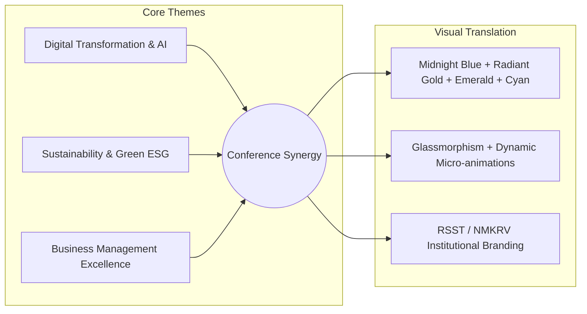
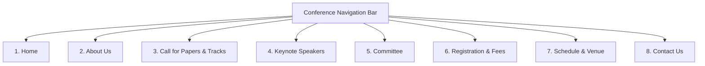

# Website Design & Theme Proposal
## International Management Conference 2027
**Theme:** *“Digital Transformation and Sustainability in Business Management: Emerging Trends, Innovations, and Future Perspectives”*  
**Dates:** 11th & 12th February 2027  
**Host:** Department of Management, NMKRV College (Autonomous), Bengaluru (Rashtreya Sikshana Samithi Trust - RSST)

---

## 1. Executive Summary & Design Concept

Based on the official conference brochure design, the proposed website visual language bridges **high-tech innovation** (Digital Transformation, AI, Data Highway) with **environmental stewardship** (Sustainability, Clean Energy, ESG) and **academic prestige** (RV Educational Institutions / NMKRV legacy).

### Visual Metaphors & Design Pillars:
1. **The Digital Sphere & Data Currents:** Represents global connectivity, cloud infrastructure, AI models, and borderless business networks.
2. **The Clean Energy & Green Horizon:** Highlighting solar arrays, wind turbines, and lush foliage to emphasize corporate carbon neutrality, ESG metrics, and circular economic models.
3. **The Sunrise Gold Arc:** Symbolizes rising optimism, emerging market perspectives, and dawn of modern sustainable leadership.
4. **Institutional Grandeur:** Rooted in deep RV Navy Blue and Heritage Gold, reflecting RSST’s decades of academic distinction.

---

## 2. Generated Background Concepts

### A. Homepage Hero / Banner Background (16:9 Aspect Ratio)
Designed specifically to match your brochure's composition with spacious left-to-center room for headline text, countdown timer, and primary action buttons:

* **Left Zone:** Holographic 3D digital earth wireframe with luminous amber and teal data trails.
* **Center Horizon:** Warm dawn sunrise over an eco-smart metropolitan skyline.
* **Right Zone:** Clean photovoltaic solar modules and wind turbine surrounded by lush greenery.
* **File Stored at:** `assets/hero_banner_bg.jpg`

#### Live Prototype Render Preview:

---

### B. Internal Pages Panoramic Header Background (16:9 Aspect Ratio)
A refined, minimalist header canvas for secondary pages (Call for Papers, Committee, Registration, Schedule, etc.) ensuring readability for page titles and breadcrumbs:

* **Aesthetic:** Deep cosmic navy with flowing cyber-mesh waveforms, golden starlight micro-accents, and soft emerald bio-curves.
* **File Stored at:** `assets/inner_page_bg.jpg`

---

## 3. Curated Color Palette & Design Tokens

| Token Name | Hex Code | Visual Swatch | Semantic Usage |
| :--- | :--- | :--- | :--- |
| **Deep Cosmic Navy** | `#0B132B` / `#0D1B2A` | Dark Royal Blue | Primary background, footer, deep contrast surfaces |
| **RV Institutional Navy**| `#102A43` | Oxford Blue | Header navigation bar, institutional crest container |
| **Sunrise Amber Gold** | `#E5A93C` / `#F59E0B` | Warm Gold | "Department of Management", dates highlight, badges |
| **Sustainability Emerald**| `#10B981` / `#22C55E`| Eco Green | "Sustainability" gradients, track highlights, success states |
| **Cyber Cyan / Teal** | `#00F2FE` / `#00C9A7` | Electric Cyan | "Digital Transformation" glows, active links, glow borders |
| **Frosted Glass (Dark)**| `rgba(15, 23, 42, 0.75)` | Translucent Blue | Content cards, modal overlays, track panels |
| **Crisp Light Text** | `#F8FAFC` / `#FFFFFF` | Pure White / Slate | Headings, primary readability text |
| **Muted Slate Text** | `#94A3B8` | Cool Gray | Subtext, captions, timestamps, disclaimers |

---

## 4. Typography Hierarchy

* **Institutional Title / Department Presentation:**
  * *Font:* **Cinzel** or **Playfair Display** (Classic Roman Serif)
  * *Style:* Gold accent `#E5A93C`, uppercase, letter-spacing `+2.5px`, reflecting academic heritage.
* **Conference Core Theme ("Digital Transformation & Sustainability"):**
  * *Font:* **Montserrat** or **Outfit** (Bold, Geometric Sans-Serif)
  * *Style:* Weight 800/900, uppercase, high contrast with dual-gradient text fill (Cyan-to-Emerald for "Sustainability").
* **Body Copy & Information Architecture:**
  * *Font:* **Plus Jakarta Sans** or **Inter**
  * *Style:* Crisp, highly legible at small viewports, optimized for academic papers, tables, and schedules.

---

## 5. Proposed Tab-Wise Website Structure

### Detailed Tab Specifications:

#### Tab 1: Home
* **Top Utility Bar:** NMKRV College Accreditation Badges (NAAC 'A+', Autonomous status, RSST Crest), Quick Contact, "Submit Paper" Quick CTA.
* **Hero Banner Section:** 
  * RSST Crest & NMKRV College Emblem
  * "Department of Management Presents"
  * Two Days International Conference on "Digital Transformation & Sustainability in Business Management"
  * Dates: **11th & 12th February 2027** | Mode: **Hybrid / In-Person** (To be confirmed)
  * Live **Countdown Timer** to 11 Feb 2027
  * Dual Action CTAs: `[ Register Now ]` & `[ Submit Abstract / Paper ]`
* **Four Pillar Highlights:** 
  * 🧠 Digital Innovation
  * 🍃 Sustainable Futures
  * 📈 Business Excellence
  * 👥 Global Collaboration
* **Important Dates Widget:** Submission Deadline, Notification of Acceptance, Camera-ready Submission, Conference Dates.
* **Publication Partners Strip:** Proposed Scopus-indexed / UGC-CARE / ISBN Proceedings publication logos.
* **Quick About Snippet:** Welcome message from Conference Chair / Principal.

#### Tab 2: About Us
* **About RSST (Rashtreya Sikshana Samithi Trust):** Legacy of RV Educational Institutions since 1940.
* **About NMKRV College for Women:** Autonomous institution, academic excellence, NAAC accreditation, research culture.
* **About Department of Management:** Vision, mission, industry connections, academic achievements.
* **Conference Scope & Rationale:** Why Digital Transformation & Sustainability in 2027? Expected outcomes and academic contribution.

#### Tab 3: Call for Papers & Conference Tracks
* **Conference Tracks (Card Grid):**
  * *Track 1: AI, Data Analytics & Digital Business Models*
  * *Track 2: Sustainable Finance, Green Accounting & ESG Investing*
  * *Track 3: Human Resource 5.0, Future of Work & Ethical Leadership*
  * *Track 4: Green Marketing, Conscious Consumerism & Brand Strategy*
  * *Track 5: Circular Economy, Green Supply Chain & Logistics*
  * *Track 6: Industry 4.0/5.0, Entrepreneurship & MSME Innovation*
* **Submission Guidelines:** Word limit (Full paper 4000–6000 words, Abstract 250–300 words), APA / Harvard reference format, IEEE format template download button (`.docx` / `.pdf`).
* **Publication & Proceedings:** Peer-review mechanism, publication in indexed journals (Scopus/Web of Science/UGC-CARE) and ISBN Edited Book.
* **Submission Portal Link / Email:** Integrated portal link or dedicated submission email.

#### Tab 4: Speakers & Guests
* **Chief Guests & Inaugural Keynote Address**
* **International Resource Persons / Keynote Speakers:** Grid cards with speaker portrait, name, designation, university/organization, country flag, and session title.
* **Industry Leaders & Panelists**

#### Tab 5: Organizing Committee
* **Chief Patrons:** Trustees & Office Bearers, Rashtreya Sikshana Samithi Trust.
* **Patron:** Principal, NMKRV College for Women.
* **Conference Chair & Director:** Head, Department of Management.
* **Conveners & Organizing Secretaries:** Faculty coordinators.
* **National & International Advisory Board:** Eminent academicians from top global and national universities.
* **Editorial & Review Committee**
* **Student Organizing Committee**

#### Tab 6: Registration & Guidelines
* **Interactive Fee Matrix Table:**
  * Academic Faculty / Educators (Indian & International)
  * Research Scholars & PhD Candidates
  * Post-Graduate & Under-Graduate Students
  * Industry Professionals & Corporate Delegates
  * Attendees / Non-Presenting Observers
* **Payment Modes & Bank Details:**
  * Account Name: NMKRV College / Conference Account
  * Account Number, IFSC Code, Bank & Branch Name
  * Official UPI QR Code for instant Indian payment
  * International Wire Transfer / SWIFT Code instructions
* **Registration Steps / Google Form or Portal Link**
* **Guidelines for Authors:** Presentation mode, certificate eligibility, co-author registration rules.

#### Tab 7: Schedule & Venue
* **Day-by-Day Program Schedule:**
  * Day 1 (11 Feb 2027): Registration, Inaugural Ceremony, Keynote 1, Track Presentations (Parallel Sessions), Panel Discussion.
  * Day 2 (12 Feb 2027): Keynote 2, Track Presentations, Valedictory Ceremony, Best Paper Awards, Certificate Distribution.
* **Campus Venue Information:**
  * NMKRV College for Women Campus, Jayanagar 3rd Block, Bengaluru, Karnataka, India.
  * Interactive Google Maps embed.
  * Nearby Airport / Metro / Railway connectivity details.
  * Recommended hotels and guest accommodation nearby.

#### Tab 8: Contact Us & Query Desk
* **Faculty Coordinator Contacts:** Names, Phone Numbers, Email addresses.
* **Direct Query Form:** Quick submission form for paper queries, fee verification, accommodation assistance.
* **Social Media & RV Group Portals**

---

## 6. Information & Asset Checklist Required from NMKRV Department

To complete the website content without placeholders, kindly provide the following materials as available:

| S.No | Item Required | Description / Recommended Format | Status |
| :---: | :--- | :--- | :---: |
| 1 | **High-Res Logos** | Official RSST Emblem & NMKRV College Crest (Vector SVG or PNG with transparent background) | *Pending* |
| 2 | **Important Dates** | Abstract Submission, Full Paper Deadline, Acceptance Notification, Registration End Date | *Pending* |
| 3 | **Publication Details** | Confirmed Journal names (Scopus, UGC-CARE list, or ISBN book publisher) | *Pending* |
| 4 | **Confirmed Speakers** | High-res photos (square 1:1, min 600x600px), designations, bios, and session topics | *[TO BE CONFIRMED]* |
| 5 | **Committee Names** | Official list of Chief Patrons, Patrons, Chair, Conveners, Advisory Board members | *Pending* |
| 6 | **Registration Fee Structure** | Exact category-wise INR and USD fees for presenting authors and attendees | *Pending* |
| 7 | **Bank / Payment Details** | Beneficiary name, Bank name, A/C No., IFSC, SWIFT Code, UPI ID / QR code image | *Pending* |
| 8 | **Paper Template** | Standard Word / PDF template (IEEE, Springer, or custom NMKRV format) | *Optional* |
| 9 | **Campus Photos** | 2–3 high-resolution photos of NMKRV auditorium / seminar hall / campus entrance | *Recommended* |

---

## 7. Next Steps & Approval Workflow

1. **Review Theme & Visual Aesthetics:** Kindly review this proposal and the generated background designs (`assets/hero_banner_bg.jpg` and `assets/inner_page_bg.jpg`).
2. **Review Interactive Preview:** An interactive live prototype (`index.html`) is prepared showcasing the typography, countdown, tab architecture, and responsiveness.
3. **Submit Text Draft & Confirmed Data:** Once the organizing committee approves the design concept and fills in confirmed dates/fees/committee names, the final production website will be built and deployed.
